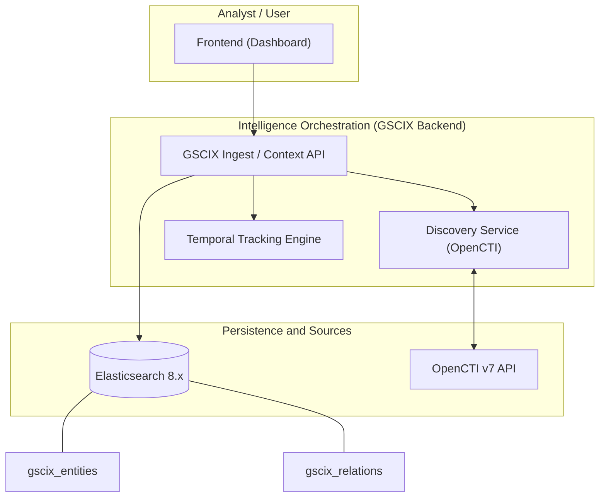

Here is a professional, high-impact GitHub description for your project, designed to attract both developers and intelligence analysts.

---

# GSCIX: Geo-Strategic Cyber Intelligence Extension

**GSCIX** is an advanced intelligence orchestration platform designed to bridge the gap between high-level geopolitical shifts and tactical cyber operations. By implementing the **GSCI Framework**, this application acts as the "Strategic Brain" that correlates global geostrategic indicators with technical threat actor activity tracked in platforms like **OpenCTI**.

## 🎯 Project Purpose

Traditional Cyber Threat Intelligence (CTI) often focuses on the *how* (malware, infrastructure) and the *who* (APTs). **GSCIX** focuses on the **"Why"** and the **"When"**. It allows analysts to predict surges in cyber activity by monitoring geopolitical "heat maps," diplomatic tensions, and doctrinal shifts.

## 🚀 Key Features

* **Strategic-to-Tactical Mapping:** Maintains a segregated, state-of-the-art Elasticsearch-backed graph that links **Geo-Strategic Actors** to technical **Intrusion Sets** and **Threat Actors** via the OpenCTI v7 API.
* **Hybrid Campaign Tracking:** Groups multi-domain operations (Cyber, Information Ops, Economic Pressure) into unified strategic containers.
* **Dynamic Scoring Engine:** Calculates real-time indices including:
* **HPI (Hybrid Pressure Index):** Measuring cumulative pressure on a target.
* **EPS (Escalation Probability Score):** Forecasting imminent cyber-attacks based on diplomatic or military signals.


* **STIX 2.1 Native:** Built from the ground up to respect STIX standards, ensuring interoperability even for custom geostrategic objects.
* **Enterprise Architecture:** Powered by **Java 21 / Spring Boot** and **Elasticsearch 8.x** for high-performance intelligence processing.

## 🛠 Tech Stack

* **Language:** Java 21 (Spring Boot) / Node.js
* **Data Store:** Elasticsearch 8.x
* **Integration:** GraphQL (OpenCTI v7)
* **Data Standard:** STIX 2.1

## 🏛 The GSCI Framework

GSCIX is the first implementation of the **Geostrategic Cyber Intelligence (GSCI)** model, which replaces the linear actor-victim flow with a multi-layered influence model that instrumentalizes technical capabilities:

> **State Actor** (`x-geo-strategic-actor`) → **Strategic Objective** → **Hybrid Campaign** → **Cyber Instrument** (APT / OpenCTI) → **Strategic Effect**

For more details on the entities used, consult the [detailed custom schemas documentation](custom_schemas/README.MD).

---

*Disclaimer: GSCIX is designed for sovereign intelligence analysis and geostrategic research.*

## 🏛 System Architecture

GSCIX uses a decoupled architecture designed for processing geo-strategic intelligence with high performance and scalability.

### Architecture Diagram


### Key Components
1.  **GSCIX Backend (Java 21/Spring Boot):** The core of the system that handles business logic, STIX mapping, and risk index integration (HPI/EPS).
2.  **Elasticsearch 8.x:** High-speed search and graph engine for storing custom geo-strategic entities and their dynamic relations.
3.  **OpenCTI Integration:** Automatic discovery layer that links abstract actors with technical groups (APT) via the OpenCTI v7 GraphQL API.
4.  **Temporal Engine:** Module responsible for managing `first_seen` and `last_seen` fields to mitigate recency bias.

## 🌐 Frontend Integration

GSCIX is designed to be consumed by a modern analytical dashboard. The recommended integration strategy is:

### Suggested Tech Stack
- **Framework:** React 18+ or Vite for a reactive interface.
- **State Management:** TanStack Query (React Query) for efficient API synchronization.
- **Data Visualization:**
    - **D3.js / Cytoscape:** For the geo-strategic influence graph.
    - **Recharts:** For visualizing risk trends (HPI and EPS).
- **Styling:** Vanilla CSS or Shadcn/UI for a premium "Command Center" aesthetic.

### API Interaction
The frontend primarily consumes data from the following endpoints:
- `POST /api/v1/geopolitical/ingest`: For processing new pieces of intelligence.
- `GET /api/v1/search` (Under development): For strategic graph exploration.

---

## 🧪 Technical Testing and Operations Guide

Follow this guide to validate GSCIX system capabilities, from manual ingestion to NotebookLM integration.

### 1. Ingestion from NotebookLM (Massive Loading)
Simulates the reception of an AI-distilled analysis. This process automatically creates the actor, their objectives, the campaign, and impact indicators.

```bash
curl -X POST http://localhost:8081/api/v1/geopolitical/ingest \
     -H "Content-Type: application/json" \
     -d @custom_schemas_tests/federacion_rusa.json
```

### 2. Ingesta Nativa de Bundles STIX 2.1 (Interoperabilidad Pro)
Para importar inteligencia compleja y relacional cumpliendo el estándar STIX 2.1 (usando UUIDs y `extensions` SDR).

```bash
curl -X POST http://localhost:8081/api/v1/geopolitical/bundle \
     -H "Content-Type: application/json" \
     -d @custom_schemas_tests/bundle_china_optimized.json
```

### 3. Alta Manual de Entidades (Contrato de Datos)
Para registrar un actor o grupo específico con metadatos simplificados:

```bash
curl -X POST http://localhost:8081/api/v1/geopolitical/ingest \
     -H "Content-Type: application/json" \
     -d '{
       "actor_name": "APT28",
       "strategic_alignment": "Revisionist",
       "geopolitical_context": "Unidad 26165 del GRU.",
       "revisionist_index": 9.5
     }'
```

### 3. Recuperación de Entidades e Inteligencia
Consulta el "cerebro estratégico" (Elasticsearch) para ver los datos procesados y normalizados.

*   **Listar todas las entidades GSCIX:**
    ```bash
    curl -s http://localhost:9200/gscix_entities/_search?pretty
    ```

*   **Buscar un actor específico y sus atributos GSCI:**
    ```bash
    curl -s 'http://localhost:9200/gscix_entities/_search?q=name:APT28&pretty'
    ```

### 4. Sincronización con OpenCTI (Threat Actors)
GSCIX descubre automáticamente relaciones con la base técnica de OpenCTI.

*   **Verificar vinculación:** Al realizar una ingesta, revisa el campo `opencti_matches` en la respuesta JSON. Si el actor existe en OpenCTI, GSCIX creará un puntero automático.
*   **Recuperar relaciones técnicas:**
    ```bash
    curl -s http://localhost:9200/gscix_relations/_search?pretty
    ```

### 5. Actualización y Evolución de Datos
Para actualizar el estado de un actor (ej. cambio en su índice de riesgo), realiza una nueva ingesta con el mismo nombre de actor:

```bash
curl -X POST http://localhost:8081/api/v1/geopolitical/ingest \
     -H "Content-Type: application/json" \
     -d '{
       "actor_name": "Federación Rusa",
       "revisionist_index": 9.8,
       "geopolitical_context": "Escalada detectada en el sector Báltico."
     }'
```
*Nota: El sistema detectará la identidad y actualizará los indicadores de impacto y riesgo en Elasticsearch.*